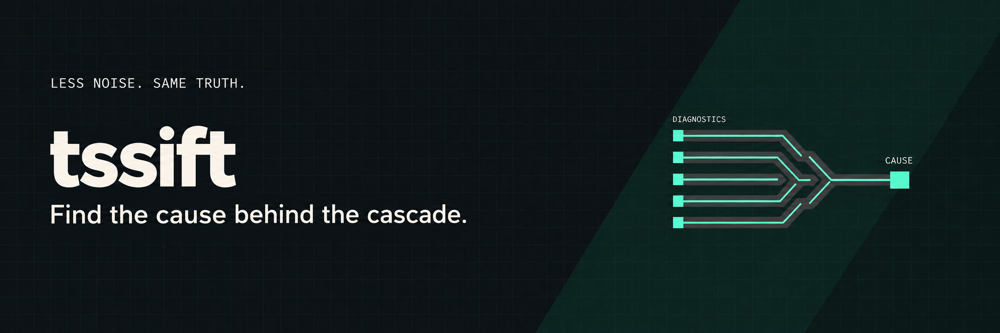
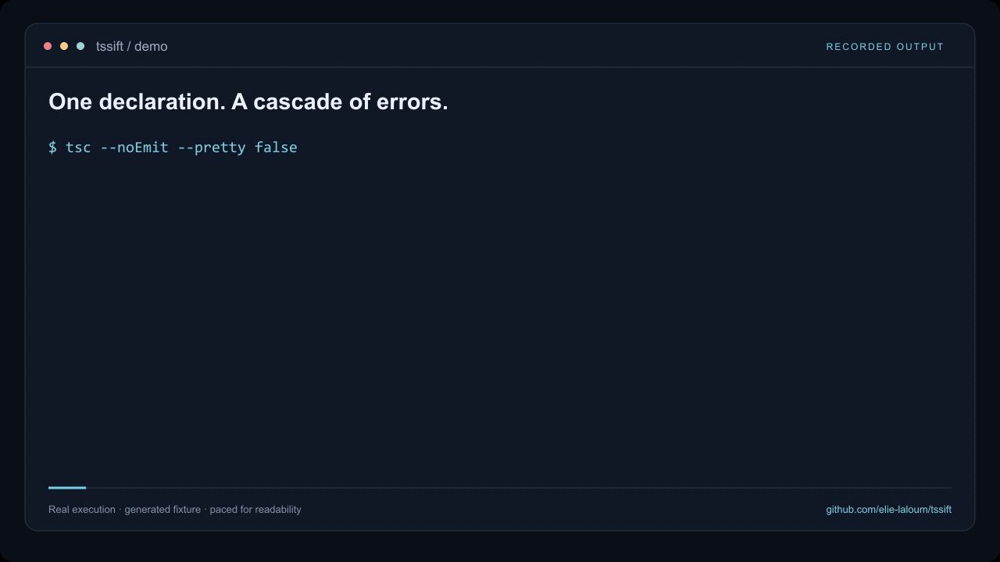

<p align="right"><a href="README.md">English</a></p>


[](https://github.com/elie-laloum/tssift/actions/workflows/ci.yml) [](LICENSE)

**Une déclaration modifiée peut déclencher des dizaines d’erreurs TypeScript. tssift regroupe les diagnostics liés et place leur cause commune en premier.**

Les messages natifs restent intacts. Le rapport complet reste accessible. Vous choisissez quoi corriger.

## Voir la démo

<a href="assets/demo.mp4"></a>

Sorties réelles du cas de test `dispatch-arity-changed`, avec annotations et rythme de lecture ajusté. Aucun modèle n’intervient. [Reproduire la démo](docs/demo.md).

## Essayer

Version initiale **0.0.1**, pas encore publiée sur npm.

```sh
git clone https://github.com/elie-laloum/tssift.git
cd tssift
mise install
mise exec -- bun install --frozen-lockfile
mise exec -- bun run build
mise exec -- node dist/cli.js --project /chemin/vers/tsconfig.json
```

Le projet analysé fournit TypeScript. Compatibilité annoncée : Node 20.19+, TypeScript 5.4–6.x, tests sous Ubuntu. `--format json` conserve tous les diagnostics ; `--all` affiche tous les emplacements ; `--budget-tokens 1200` limite approximativement le texte sans tronquer les causes.

## Ce qui est mesuré

**La réduction du texte est démontrée ; le gain pour un agent ne l’est pas.** La campagne la plus complète consomme 106 % des tokens du bras `tsc`, résout 28 cas sur 30 contre 30 sur 30 et compte 9 faux départs contre 5. Les résultats négatifs et les limites sont conservés dans [EVAL.md](EVAL.md).

L’outil ne modifie aucun fichier et ne prescrit pas de correction. Les relations incertaines restent séparées. TypeScript 7 et les configurations de solution avec références de projets sont refusés.

[Documentation complète en anglais](README.md) · [Guide technique](docs/guide.md) · [Licence MIT](LICENSE)

[GitLab origin](https://gitlab.elielaloum.com/elielaloum/tssift) · [Public GitHub mirror](https://github.com/elie-laloum/tssift)

The private GitLab repository is the source of record. Changes are synchronized to GitHub.
